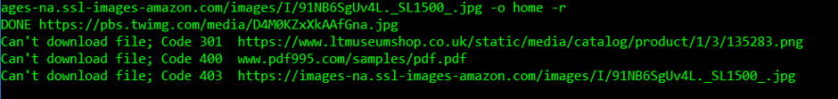

## FUNCTIONS
### define_args() & define_requirements(arguments)
define_args function uses the argparse library in python to parse through the command line arguments and define_requirements iterates through the object returned by define_args and puts them into global variables.
### parseURL(fileURL)
goes through the URL and retrieves the server, on which file is hosted (for IP Address), file name and its extension
### get_info(fileURL,PORT)
takes as input the file URL, uses the parseURL function to split up the URL. Then connects to the Server and Retrieves the Header for the desired file. From that header it determines the Response Code and whether the server allows Http Byte Range Functionality or not. If so, it also retrieves the Content Length
### start_connection(fileURL, port, conn_id, bytes_start,bytes_end,file_pieces, resume_download)
designed for the purpose of a Specific Byte Range Download on an independent Connection. It receives a conn_id which differentiates it from the other start_connection threads. Additional arguments include start byte, end byte and a Boolean whether the file specified must be resumed for downloading. In addition to that this function also writes the bytes downloaded to a file with conn_id suffixed in the name.
### file_thread(fileURL, port, num_connections, content_length, accept_ranges,resume_download ,output_location)
designed to allot each file a specific thread so that all files download in parallel. It uses the start_connection function to further thread its download on multiple connections. At the end of this functions all the binary files downloaded on the start_connection thread are combined to a single binary file.
## USAGE
#### Example Command
Open command prompt in the directory that has been zipped with this file. Type the following command:

    python httpC.py -nf 3 -n 4 -i 0.5 -f https://pbs.twimg.com/media/D4M0KZxXkAAfGna.jpg https://www.ltmuseumshop.co.uk/static/media/catalog/product/1/3/135283.png www.pdf995.com/samples/pdf.pdf https://images-na.ssl-images-amazon.com/images/I/91NB6SgUv4L._SL1500_.jpg -o home -r

The above command specifies 3 images to be downloaded into the directory “home”. The can’t download states that server restricts permission to download. The output for the command will be:

